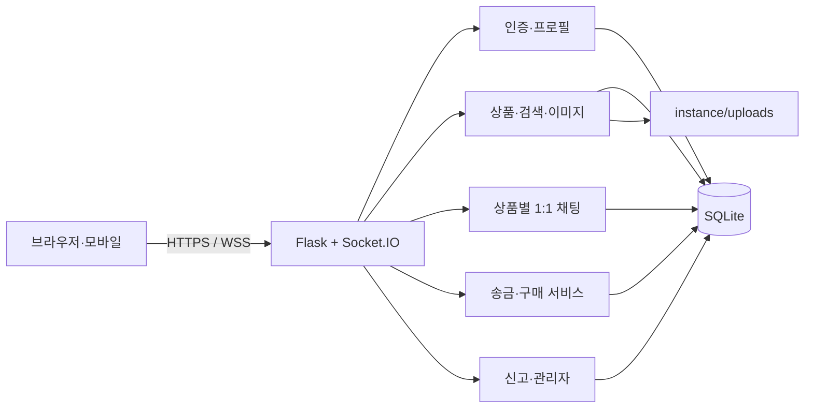
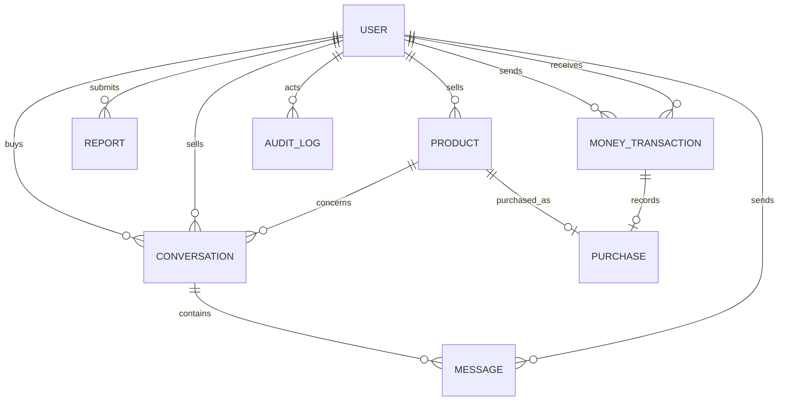
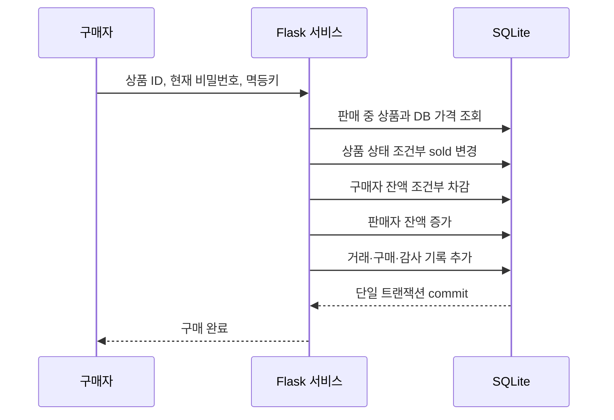

# 파일마켓 개발 보고서

| 구분 | 내용 |
|---|---|
| 과제 | Tiny Second-hand Shopping Platform |
| 제출자 | `[XX반] 이름 / 전화번호 뒷자리` |
| 개발 기간 | 2026-07-19 ~ 제출일 |
| 언어·프레임워크 | Python 3.12, Flask, Jinja2, Flask-SocketIO, SQLAlchemy |
| 개발 환경 | uv, `pyproject.toml`, `uv.lock`, Docker Compose |
| 공개 GitHub | `<본인의 Public GitHub 저장소 URL>` |
| 제출 파일명 | `[WHS][secure-coding][XX반]이름(전화번호뒷자리).pdf` |

> 제출 전 표의 개인정보와 Public GitHub URL을 실제 값으로 교체하고, 외부 기기 시연 화면을 첨부해야 한다.

## 1. 과제 개요와 목표

제공된 Python 3 + Flask 웹앱 코드를 기반으로 확장하여 추가 기능을 구현했다. 목표는 단순히 화면이 작동하는 중고거래 서비스를 만드는 데 그치지 않고 요구사항 분석, 시스템 설계, 구현, 체크리스트 작성과 테스트, 유지보수의 전 과정을 거치면서 각 단계에서 보안 약점을 찾아 개선하는 것이었다.

구현 대상은 회원, 상품, 사용자 간 소통, 신고와 차단, 회원 간 송금, 상품 검색, 관리자 기능의 7개 필수 요구사항이다. 실제 금융 서비스와 연결하지 않고 서비스 내부 잔액을 원화 단위로 표현했다. 신규 회원의 초기 잔액은 1,000,000원이다.

## 2. 기존 제공 코드 분석

기존 코드는 Flask 단일 파일, SQLite 직접 쿼리, Jinja2 템플릿으로 구성되어 있었다. 회원가입·로그인·프로필·상품 등록과 조회·신고·전체 채팅의 최소 흐름은 있었지만 과제의 완성 기능과 보안 기준을 충족하지 못했다.

| 기존 상태 | 확인한 문제 | 영향 |
|---|---|---|
| `SECRET_KEY = 'secret!'` | 비밀키 하드코딩 | 세션 서명 위조 위험 |
| 비밀번호 문자열을 DB에 직접 저장 | 평문 비밀번호 | DB 유출 시 즉시 계정 탈취 |
| 사용자명과 비밀번호를 함께 SQL 조회 | 별도 로그인 실패 보호 없음 | 무차별 대입 가능 |
| 모든 상태 변경 폼 | CSRF 토큰 없음 | 다른 사이트를 통한 요청 위조 가능 |
| 상품 수정·삭제 없음 | 소유권 검사도 없음 | 필수 기능 미충족 |
| 상품 가격이 문자열 | 숫자·범위·무결성 검증 없음 | 음수·비정상 가격 가능 |
| 전체 채팅 이벤트 | 클라이언트가 사용자명을 전송하고 전체 broadcast | 사용자 사칭·도배·정보 노출 가능 |
| 신고 기능 | 대상 존재·중복·사유 길이 검사 없음 | 신고 남용과 잘못된 데이터 저장 |
| `debug=True` 실행 | 내부 오류 정보 노출 | 공격자에게 코드·경로·DB 정보 제공 가능 |
| 단일 `app.py` | 기능과 보안 로직이 뒤섞임 | 변경 시 누락·회귀 위험 증가 |

기존 문제는 Git 최초 커밋과 본 보고서의 수정 전·후 표를 통해 확인할 수 있다. 완성 코드에는 해당 취약 구현을 남겨두지 않았다.

## 3. 요구사항 분석과 추적

| ID | 요구사항 | 세부 수용 조건 | 구현 위치 | 검증 |
|---|---|---|---|---|
| RQ-01 | 플랫폼 가입과 회원 관리 | 고유 사용자명, 로그인, 회원 검색, 소개글, 비밀번호 변경 | `auth.py`, `users.py` | 가입·해시·잠금·XSS 테스트 |
| RQ-02 | 상품 등록과 조회 | 상품명·가격·사진·설명, 목록·상세, 본인 상품 관리 | `products.py` | 소유권·이미지 테스트 |
| RQ-03 | 사용자 간 소통 | 상품별 구매자·판매자 실시간 1:1 채팅 | `chat.py` | 대화 고유성·IDOR·Socket 테스트 |
| RQ-04 | 악성 사용자·상품 차단 | 상세 신고, 중복 방지, 3인 신고, 관리자 복구 | `reports.py`, `admin.py` | 상품 숨김·회원 정지 테스트 |
| RQ-05 | 회원 간 송금 | 1,000,000원 초기 잔액, 직접 송금, 상품 구매, 거래 내역 | `services.py`, `users.py` | 잔액·중복·정정 테스트 |
| RQ-06 | 상품 검색 | 제목·설명, 가격 범위, 판매 상태 | `products.py` | 1,000개 상품 성능 테스트 |
| RQ-07 | 관리자 관리 | 회원·상품·신고·거래·채팅·감사 로그 | `admin.py` | 일반 사용자 403·정정 테스트 |

기능 요구사항 외에 보안, 반응형 디자인, 1,000개 상품 검색 1초 이내를 비기능 요구사항으로 정했다.

## 4. 요구사항 변경 이력

### 공개 채팅 제외

강의의 시스템 설계 예시에는 전체 사용자 채팅과 1대1 채팅이 함께 있었고, 제공 코드에도 대시보드 전체 채팅이 존재했다. 그러나 중고거래의 실제 소통은 특정 상품의 구매자와 판매자 사이에서 이루어진다. 공개 채팅을 유지하면 다음 문제가 추가된다.

- 상품 거래와 무관한 도배·광고·욕설 관리가 필요하다.
- 모든 사용자에게 메시지가 노출되어 개인정보가 퍼질 가능성이 커진다.
- 사용자가 판매자를 사칭하기 쉬운 기존 broadcast 구조를 별도로 유지해야 한다.
- 필수 기능 개발 시간에 비해 거래 흐름에 주는 가치가 낮다.

따라서 상위 요구사항인 사용자 간 소통을 상품별 1대1 채팅으로 충족하고 공개 채팅은 제거했다. 대화방은 상품·구매자·판매자의 고유 조합으로 만들고 세션에서 확인한 참여자만 접근할 수 있게 했다. 이 변경은 기능 축소만을 위한 것이 아니라 중고거래 목적에 맞게 범위를 좁히고 공격 표면과 운영 부담을 줄인 결정이다.

### 내부 원화 잔액

실제 PG·은행 계좌를 연결하면 금융 계약, 본인확인, 환불, 판매자 정산이 필요해 과제 범위를 벗어난다. 대신 화면과 데이터는 원화 정수로 통일하고 내부 잔액만 이동하도록 했다. 실제 금융 개인정보는 수집하지 않는다.

### Miniconda 대신 uv 사용

강의 자료에서는 파이썬 가상환경 구성 도구의 예시로 Miniconda를 사용했지만, 본 프로젝트의 의존성은 모두 PyPI에서 제공되는 Python 패키지다. CUDA, R, 별도 네이티브 도구 모음처럼 Conda 환경이 필요한 구성도 없다. 따라서 설치 도구와 의존성 선언이 중복되는 문제를 줄이기 위해 Miniconda 환경 파일과 requirements 파일을 제거하고 uv로 통일했다.

`pyproject.toml`에 Python 버전, 운영 의존성, 개발 의존성을 선언하고 `uv.lock`에 간접 의존성까지 고정했다. 로컬 실행, 테스트, 정적 분석, 의존성 감사는 모두 `uv run --frozen`으로 수행하며 Docker도 동일한 잠금 파일을 `uv sync --frozen`으로 설치한다. 이 변경으로 운영체제별 활성화 명령이 사라지고, 새로 복제한 환경과 컨테이너가 같은 의존성 집합을 사용하게 됐다. 과제에서 프로그래밍 언어와 구현 방식에 별도 제약을 두지 않았다는 안내에도 부합한다.

## 5. 비기능 요구사항

- 보안: 제공된 27개 체크리스트와 확장 항목을 모두 점검한다.
- 디자인: 데스크톱·태블릿·모바일에서 사용할 수 있는 반응형 화면을 제공한다.
- 성능: SQLite 테스트 DB에 상품 1,000개를 넣은 검색 요청이 1초 안에 끝나야 한다.
- 호환성: Linux, WSL, macOS 및 Windows에서 같은 uv 명령으로 실행하고 Docker Compose도 같은 잠금 파일을 사용해야 한다.
- 재현성: 공개 저장소를 새로 clone한 뒤 README만 보고 실행할 수 있어야 한다.

## 6. 시스템 설계

### 구조도



Flask 애플리케이션 팩토리가 공통 설정과 확장을 초기화하고 인증, 상품, 회원, 채팅, 신고, 관리자를 Blueprint로 분리한다. 비밀번호·입력·이미지 검증은 `security.py`, 잔액 이동·구매·자동 차단·정정은 `services.py`에 두어 라우트가 같은 보안 규칙을 사용하도록 했다.

### ERD



주요 무결성 제약은 사용자명 중복 금지, 잔액 0원 이상, 상품 가격 양수, 상품·구매자·판매자별 대화방 하나, 사용자별 동일 대상 신고 한 번, 멱등키별 거래 한 번, 상품별 구매 한 번이다.

### 구매 흐름



클라이언트가 보낸 가격은 사용하지 않는다. 하나라도 실패하면 전체 DB 트랜잭션을 rollback한다.

### 1대1 채팅 흐름

1. 구매자가 상품 상세에서 문의를 시작한다.
2. 서버가 상품·구매자·판매자 조합으로 기존 대화방을 조회하거나 하나만 만든다.
3. Socket 연결 시 로그인 세션을 확인한다.
4. 방 참가와 메시지 전송마다 CSRF, UUID, 대화 참여자, 메시지 길이, 전송 횟수를 확인한다.
5. 서버가 확인한 사용자명과 메시지를 같은 방 참여자에게만 전송한다.

## 7. 기능 구현

### 회원

사용자명은 한글·영문·숫자·밑줄 3~20자로 제한했다. 비밀번호는 영문·숫자·특수문자를 포함한 10~128자로 받고 Argon2id로 저장한다. 로그인 실패가 5회 누적되면 5분 동안 계정을 잠그고 IP별 요청 제한도 함께 적용한다. 로그인 시 기존 세션을 비우고 30분 만료와 strong session protection을 사용한다.

### 상품과 이미지

상품 등록·조회·검색·수정·삭제를 제공하며 판매자 본인 또는 관리자만 수정할 수 있다. JPEG·PNG·WebP의 실제 형식을 Pillow로 확인하고 6MB, 한 변 5,000픽셀, 전체 25MP로 제한한다. 이미지는 UUID 이름으로 다시 인코딩해 경로 문자열과 메타데이터를 제거한다.

### 송금과 구매

금액은 1원 이상 10억 원 이하의 정수만 허용한다. 직접 송금과 구매에는 현재 비밀번호와 UUID 멱등키가 필요하다. 잔액 차감은 `balance >= amount` 조건부 UPDATE로 수행하고 DB CHECK로 음수 잔액을 한 번 더 막는다. 완료 거래를 수정하거나 삭제하는 기능은 제공하지 않는다. 관리자가 정정할 때 반대 방향의 `adjustment` 거래를 새로 만들고 사유를 감사 로그에 남긴다.

### 신고와 관리자

신고 사유는 10~1,000자로 받고 같은 사용자의 동일 대상 중복 신고는 DB 고유 제약으로 막는다. 서로 다른 3명의 미처리 신고가 쌓이면 상품은 숨김, 일반 회원은 임시 정지한다. 자동 조치는 영구 삭제가 아니며 관리자가 근거를 검토해 복구·정지·차단할 수 있다.

## 8. 적용한 시큐어 코딩

- Argon2id 비밀번호 해시와 재해시 검사
- 전역 CSRFProtect와 Socket 이벤트 CSRF 검증
- ORM·매개변수 바인딩과 DB 제약
- 로그인·상품·채팅·관리자의 객체 단위 접근 통제
- 송금 조건부 UPDATE, 단일 DB 트랜잭션, 멱등키
- 안전한 이미지 형식 검사·크기 제한·재인코딩
- CSP, frame 차단, nosniff, Referrer·Permissions Policy, HTTPS HSTS
- 운영 debug 비활성화와 일반 오류 화면
- 환경변수 또는 권한 600 자동 비밀키
- 비루트 Docker 사용자와 `no-new-privileges`
- 관리자·신고·거래의 감사 가능한 기록
- uv 잠금 파일, Ruff, Bandit, pip-audit와 pytest 회귀 테스트

세부 결과는 `SECURITY_CHECKLIST.md`에 제공된 27개 원문 항목과 확장 13개 항목으로 기록했다.

## 9. 보안 약점 수정 전·후

| 약점 | 수정 전 | 수정 후 | 검증 |
|---|---|---|---|
| 비밀번호 | 평문 저장 | Argon2id | 해시 접두사·평문 불일치 테스트 |
| 비밀키 | `secret!` 하드코딩 | 환경변수 또는 권한 600 랜덤 파일 | 민감 패턴 검색 |
| CSRF | 없음 | HTTP 폼·Socket 검증 | 무토큰 POST 400 |
| 권한 | 로그인 여부 위주 | 소유자·참여자·관리자 RBAC | 상품·채팅·관리자 403 테스트 |
| 채팅 사칭 | 클라이언트 사용자명 broadcast | 세션 사용자와 1대1 room | 참여자·제3자 Socket 테스트 |
| 거래 | 기능 없음 | 조건부 잔액 이동·멱등키·거래 기록 | 중복·가격 위변조·정정 테스트 |
| 신고 | 대상·중복 검사 없음 | 실존 대상·고유 제약·3인 임계값 | 신고 테스트 |
| 이미지 | 기능 없음 | 형식·용량·픽셀·재인코딩 | 위장·경로 파일명 테스트 |
| 오류 | debug=True | debug=False, 일반 오류 템플릿 | 코드·응답 확인 |
| 의존성 | 버전 미고정 | 버전 고정과 감사 | audit 16건 발견 후 0건 |

## 10. 체크리스트와 테스트 결과

최종 자동 테스트 명령과 결과는 다음과 같다.

```text
uv lock --check
잠금 파일 최신 상태

uv run --frozen pytest --cov=marketplace --cov-report=term-missing
22 passed in 16.90s
TOTAL 1099 statements / coverage 71%

uv run --frozen ruff check .
All checks passed!

uv run --frozen bandit -r marketplace app.py -q
Medium 0 / High 0

uv run --frozen pip-audit
No known vulnerabilities found
```

주요 테스트는 초기 잔액, 약한 비밀번호, 로그인 잠금, XSS, CSRF, 상품 소유권, 이미지 위장, 이미지 재인코딩, 원화 송금, 가격 위변조, 중복 구매, 구매 경쟁, 관리자 정정, 3인 신고, 중복 신고, 채팅방 IDOR, Socket 참여자 검증, 1,000개 상품 검색 성능을 포함한다.

기능별 입력·예상·실제 결과와 재시험 이력은 `CHECKLIST.md`에 기록했다.

## 11. 개발 중 확인한 의존성 취약점

최초 고정 버전에 대해 pip-audit을 실행했을 때 Flask 3.1.2, Pillow 12.1.1, pytest 9.0.2에서 총 16개의 알려진 취약점이 확인됐다. Flask 3.1.3, Pillow 12.3.0, pytest 9.0.3으로 올린 뒤 `pyproject.toml`과 `uv.lock`에 반영했다. 전체 테스트를 다시 통과시키고 `uv run --frozen pip-audit`으로 재감사한 결과 알려진 취약점이 0건으로 나왔다.

이 사례는 기능 구현이 끝났더라도 의존성 버전이 안전하다고 가정하면 안 된다는 점을 보여준다. 공개 이후에도 정기적인 재검사가 필요하다.

## 12. 실제 사용·테스트 중 발견한 문제

| 현상 | 원인 | 수정 | 회귀 테스트 결과 |
|---|---|---|---|
| 첫 테스트에서 템플릿을 찾지 못함 | 애플리케이션 패키지 기준 기본 템플릿 경로와 루트 `templates` 경로 불일치 | Flask 생성 시 템플릿·정적 경로 명시 | 관련 13개 실패가 다음 실행에서 해소 |
| 테스트에서 사용자 전환이 되지 않음 | 이미 로그인한 상태에서 다른 사용자 로그인 요청이 상품 화면으로 redirect | 테스트 helper가 기존 세션을 정상 로그아웃한 뒤 로그인 | 신고·IDOR 테스트 통과 |
| 전체 실행에서 Socket 테스트가 간헐 실패 | 전역 Socket.IO 확장을 테스트 앱마다 다시 초기화 | 앱 fixture를 세션 범위로 두고 DB만 테스트마다 초기화 | 전체 22개 반복 실행 통과 |
| 의존성 감사에서 16건 발견 | 최초 선택 버전에 2026년 공개 취약점 존재 | 수정 버전으로 갱신 | audit 0건, pytest 22개 재통과 |
| 환경 설정 파일이 중복됨 | Conda 환경 파일 2개와 requirements 파일 2개가 같은 의존성을 반복 선언 | `pyproject.toml`과 `uv.lock`으로 통합 | `uv sync --frozen`, 잠금 상태 검사와 전체 회귀 테스트 통과 |
| Docker 명령이 WSL에서 실행되지 않음 | Docker Desktop WSL Integration 비활성 | Dockerfile·Compose 정적 검증까지만 진행 | 통합 활성화 후 수동 재시험 필요 |

## 13. 유지보수 계획과 현재 조치

개발 중 발견한 템플릿 경로, 세션 전환, Socket 테스트 격리, 취약 의존성 문제를 수정하고 전체 회귀 테스트를 다시 수행했다. 이후 유지보수는 다음 순서로 진행한다.

1. 문제의 화면·요청·사용자를 기록한다.
2. 자동 테스트로 재현한다.
3. 요구사항 오류인지 구현 오류인지 구분한다.
4. 해당 단계의 설계 또는 구현을 수정한다.
5. 관련 테스트와 전체 회귀 테스트를 실행한다.
6. 원인·수정·잔존 위험을 보고서와 체크리스트에 남긴다.

제출 전에는 Docker 신규 설치, ngrok HTTPS/WSS 모바일 채팅, Public GitHub 신규 clone을 실제로 수행하고 화면 증거를 추가해야 한다.

## 14. 실행과 운영

README에 uv, Docker Compose, 관리자 생성, ngrok, 환경변수, 테스트 명령을 정리했다. 로컬 환경과 Docker는 모두 `pyproject.toml`과 `uv.lock`을 기준으로 설치한다. 환경변수가 없어도 첫 실행 시 `instance/.secret_key`에 무작위 비밀키를 만들기 때문에 저장소를 복제한 뒤 별도 하드코딩 비밀키 없이 실행할 수 있다.

Docker는 비루트 사용자와 영속 instance 볼륨을 사용한다. 운영에서는 Gunicorn gthread 단일 worker를 사용한다. 다중 worker 또는 다중 서버로 확장하려면 Redis 기반 Socket.IO 메시지 큐와 공유 rate limit 저장소, PostgreSQL 도입이 필요하다.

## 15. AI 도구 활용과 사람의 검토

코드 구조 설계, 구현 초안, 테스트 케이스 확장, 정적 분석 결과 정리에 AI 코딩 도구를 활용했다. 생성 결과를 그대로 제출하지 않고 다음 항목을 직접 확인하는 절차를 두었다.

- 강의 자료의 7개 요구사항과 27개 제공 체크리스트 대조
- 각 라우트의 인증·소유권·참여자·관리자 권한 확인
- 송금의 DB 가격 사용, 조건부 차감, rollback, 멱등키 확인
- 공개 채팅 제외 이유와 잔존 위험 판단
- uv 잠금 상태, pytest, Ruff, Bandit, pip-audit 실제 실행 결과 확인
- 실패한 테스트의 원인 파악과 수정 후 전체 회귀 테스트

AI가 제안한 결과의 책임은 제출자에게 있으므로 최종 제출 전 코드를 다시 읽고 각 보안 통제의 목적과 한계를 설명할 수 있는지 확인한다.

## 16. 결론과 잔존 위험

7개 필수 요구사항을 Flask 웹앱으로 구현했고 기존 예제의 평문 비밀번호, 하드코딩 비밀키, CSRF 부재, 권한 검사 부족, 사용자 사칭 전체 채팅, 검증 없는 신고, debug 실행 문제를 제거했다. 22개 자동 테스트, 정적 분석, 의존성 감사로 주요 동작과 보안 통제를 확인했다.

남은 위험은 다음과 같다.

- SQLite와 인메모리 rate limit은 단일 서버 과제 환경에 적합하며 분산 운영에는 부적합하다.
- 관리자 MFA와 중앙 세션 폐기, 외부 WORM 감사 로그는 구현하지 않았다.
- 이미지 백신·샌드박스 검사는 없으며 형식 검사와 재인코딩까지만 제공한다.
- Socket.IO 브라우저 클라이언트 CDN에 SRI가 없어 로컬 정적 파일 또는 SRI 적용이 권장된다.
- Docker와 ngrok 외부 모바일 검증은 현재 환경 제약으로 남아 있어 제출 전 반드시 수행해야 한다.
- 실제 금융 결제가 아닌 내부 원화 잔액이므로 금융 서비스로 사용해서는 안 된다.

## 제출 전 증거 첨부 위치

1. 회원가입 후 잔액 1,000,000원 화면
2. 상품 등록·검색·상세·구매 화면
3. 데스크톱과 모바일의 구매자·판매자 1대1 채팅 화면
4. 3인 신고 후 숨김 또는 정지와 관리자 복구 화면
5. 관리자 회원·상품·거래·감사 로그 화면
6. pytest, Bandit, pip-audit 최종 통과 화면
7. Docker Compose healthcheck와 비루트 사용자 확인 화면
8. Public GitHub 저장소와 새 clone 실행 화면
